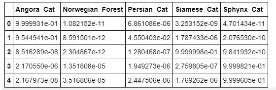
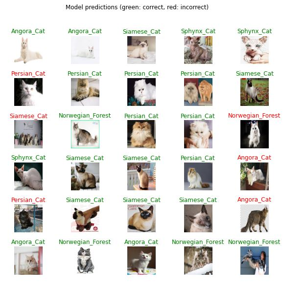

# catsRecognition_TensorflowLite
Cats Recognition with Tensorflow Lite with custom cat datasets from Google Image

Dataset consists of 5 species of cats, the dataset can be download here : https://dl.dropbox.com/s/406optki5aagpu3/jenis2_kucing.zip?dl=2

Confussion Matrix

Prediction Results

Codes belong to Tensorflow with some modification by me
